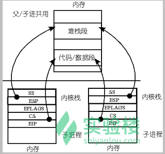

# 基于内核栈切换的进程切换

难度系数：★★★★☆

## 实验目的

- 深入理解进程和进程切换的概念；
- 综合应用进程、CPU管理、PCB、LDT、内核栈、内核态等知识解决实际问题；
- 开始建立系统认识。

## 实验内容

现在的Linux 0.11采用TSS（后面会有详细论述）和一条指令就能完成任务切换，虽然简单，但这指令的执行时间却很长，在实现任务切换时大概需要 200 多个时钟周期。而通过堆栈实现任务切换可能要更快，而且采用堆栈的切换还可以使用指令流水的并行优化技术，同时又使得CPU的设计变得简单。所以无论是 Linux还是 Windows，进程/线程的切换都没有使用 Intel 提供的这种TSS切换手段，而都是通过堆栈实现的。

本次实践项目就是将Linux 0.11中采用的TSS切换部分去掉，取而代之的是基于堆栈的切换程序。具体的说，就是将Linux 0.11中的switch_to实现去掉，写成一段基于堆栈切换的代码。

本次实验包括如下内容：

- 编写汇编程序switch_to：
- 完成主体框架；
- 在主体框架下依次完成PCB切换、内核栈切换、LDT切换等；
- 修改fork()，由于是基于内核栈的切换，所以进程需要创建出能完成内核栈切换的样子。
- 修改PCB，即task_struct结构，增加相应的内容域，同时处理由于修改了task_struct所造成的影响。
- 用修改后的Linux 0.11仍然可以启动、可以正常使用。
- （选做）分析实验4的日志体会修改前后系统运行的差别。

## 实验报告

回答下面三个问题：

**1.** 针对下面的代码片段：

```assembly
movl tss,%ecx
addl $4096,%ebx
movl %ebx,ESP0(%ecx)
```

回答问题：（1）为什么要加4096；（2）为什么没有设置tss中的ss0。

**2.** 针对代码片段：

```asm
*(--krnstack) = ebp;
*(--krnstack) = ecx;
*(--krnstack) = ebx;
*(--krnstack) = 0;
```

回答问题：（1）子进程第一次执行时，eax=？为什么要等于这个数？哪里的工作让eax等于这样一个数？（2）这段代码中的ebx和ecx来自哪里，是什么含义，为什么要通过这些代码将其写到子进程的内核栈中？（3）这段代码中的ebp来自哪里，是什么含义，为什么要做这样的设置？可以不设置吗？为什么？

**3.** 为什么要在切换完LDT之后要重新设置fs=0x17？而且为什么重设操作要出现在切换完LDT之后，出现在LDT之前又会怎么样？

## 评分标准

- switch_to(system_call.s)，40%
- fork.c，30%
- sched.h和sched.c，10%
- 实验报告，20%

## 实验提示

- **TSS切换**

在现在的Linux 0.11中，真正完成进程切换是依靠任务状态段（Task State Segment，简称TSS）的切换来完成的。具体的说，在设计“Intel架构”（即x86系统结构）时，每个任务（进程或线程）都对应一个独立的TSS，TSS就是内存中的一个结构体，里面包含了几乎所有的CPU寄存器的映像。有一个任务寄存器（Task Register，简称TR）指向当前进程对应的TSS结构体，所谓的TSS切换就将CPU中几乎所有的寄存器都复制到TR指向的那个TSS结构体中保存起来，同时找到一个目标TSS，即要切换到的下一个进程对应的TSS，将其中存放的寄存器映像“扣在”CPU上，就完成了执行现场的切换，如下图所示。


​                                                                          图1 基于TSS的进程切换

Intel架构不仅提供了TSS来实现任务切换，而且只要一条指令就能完成这样的切换，即图中的ljmp指令。具体的工作过程是：（1）首先用TR中存取的段选择符在GDT表中找到当前TSS的内存位置，由于TSS是一个段，所以需要用段表中的一个描述符来表示这个段，和在系统启动时论述的内核代码段是一样的，那个段用GDT中的某个表项来描述，还记得是哪项吗？是8对应的第1项。此处的TSS也是用GDT中的某个表项描述，而TR寄存器是用来表示这个段用GDT表中的哪一项来描述，所以TR和CS、DS等寄存器的功能是完全类似的。（2）找到了当前的TSS段（就是一段内存区域）以后，将CPU中的寄存器映像存放到这段内存区域中，即拍了一个快照。（3）存放了当前进程的执行现场以后，接下来要找到目标进程的现场，并将其扣在CPU上，找目标TSS段的方法也是一样的，因为找段都要从一个描述符表中找，描述TSS的描述符放在GDT表中，所以找目标TSS段也要靠GDT表，当然只要给出目标TSS段对应的描述符在GDT表中存放的位置——段选择子就可以了，仔细想想系统启动时那条著名的jmpi 0, 8指令，这个段选择子就放在ljmp的参数中，实际上就jmpi 0, 8中的8。（4）一旦将目标TSS中的全部寄存器映像扣在CPU上，就相当于切换到了目标进程的执行现场了，因为那里有目标进程停下时的CS:EIP，所以此时就开始从目标进程停下时的那个CS:EIP处开始执行，现在目标进程就变成了当前进程，所以TR需要修改为目标TSS段在GDT表中的段描述符所在的位置，因为TR总是指向当前TSS段的段描述符所在的位置。

上面给出的这些工作都是一句长跳转指令“ljmp 段选择子:段内偏移”，在段选择子指向的段描述符是TSS段时CPU解释执行的结果，所以基于TSS进行进程/线程切换的switch_to实际上就是一句ljmp指令：

```c
#define switch_to（n）{
	struct{long a,b;} tmp;
	__asm__("movw %%dx,%1"
	"ljmp %0" ::"m"(*&tmp.a), "m"(*&tmp.b), "d"(TSS（n）)
}

#define FIRST_TSS_ENTRY 4

#define TSS（n）(((unsigned long) n) << 4) + (FIRST_TSS_ENTRY << 3))
```

GDT表的结构如下图所示，所以第一个TSS表项，即0号进程的TSS表项在第4个位置上，4<<3，即4×8，相当于TSS在GDT表中开始的位置（以字节为单位），TSS（n）找到的是进程n的TSS位置，所以还要再加上n<<4，即n×16，因为每个进程对应有1个TSS和1个LDT，每个描述符的长度都是8个字节，所以是乘以16，其中LDT的作用就是上面论述的那个映射表，关于这个表的详细论述要等到内存管理一章。TSS（n）=n×16+4×8，得到就是进程n（切换到的目标进程）的TSS选择子，将这个值放到dx寄存器中，并且又放置到结构体tmp中32位长整数b的前16位，现在64位tmp中的内容是前32位为空，这个32位数字是段内偏移，就是jmpi 0, 8中的0；接下来的16位是n×16+4×8，这个数字是段选择子，就是jmpi 0, 8中的8，再接下来的16位也为空。所以swith_to的核心实际上就是“ljmp 空, n\*16+4\*8”，现在和前面给出的基于TSS的进程切换联系在一起了。


​                                                                                图2 GDT表中的内容

- **本次实验的内容**

虽然用一条指令就能完成任务切换，但这指令的执行时间却很长，这条ljmp 指令在实现任务切换时大概需要 200 多个时钟周期。而通过堆栈实现任务切换可能要更快，而且采用堆栈的切换还可以使用指令流水的并行优化技术，同时又使得CPU的设计变得简单。所以无论是 Linux还是 Windows，进程/线程的切换都没有使用 Intel 提供的这种TSS切换手段，而都是通过堆栈实现的。

本次实践项目就是将Linux 0.11中采用的TSS切换部分去掉，取而代之的是基于堆栈的切换程序。具体的说，就是将Linux 0.11中的switch_to实现去掉，写成一段基于堆栈切换的代码。

在现在的Linux 0.11中，真正完成进程切换是依靠任务状态段（Task State Segment，简称TSS）的切换来完成的。具体的说，在设计“Intel架构”（即x86系统结构）时，每个任务（进程或线程）都对应一个独立的TSS，TSS就是内存中的一个结构体，里面包含了几乎所有的CPU寄存器的映像。有一个任务寄存器（Task Register，简称TR）指向当前进程对应的TSS结构体，所谓的TSS切换就将CPU中几乎所有的寄存器都复制到TR指向的那个TSS结构体中保存起来，同时找到一个目标TSS，即要切换到的下一个进程对应的TSS，将其中存放的寄存器映像“扣在”CPU上，就完成了执行现场的切换。

要实现基于内核栈的任务切换，主要完成如下三件工作：（1）重写switch_to；（2）将重写的switch_to和schedule()函数接在一起；（3）修改现在的fork()。

- **schedule与switch_to**

  目前Linux 0.11中工作的schedule()函数是首先找到下一个进程的数组位置next，而这个next就是GDT中的n，所以这个next是用来找到切换后目标TSS段的段描述符的，一旦获得了这个next值，直接调用上面剖析的那个宏展开switch_to(next);就能完成如图TSS切换所示的切换了。现在，我们不用TSS进行切换，而是采用切换内核栈的方式来完成进程切换，所以在新的switch_to中将用到当前进程的PCB、目标进程的PCB、当前进程的内核栈、目标进程的内核栈等信息。由于Linux 0.11进程的内核栈和该进程的PCB在同一页内存上（一块4KB大小的内存），其中PCB位于这页内存的低地址，栈位于这页内存的高地址；另外，由于当前进程的PCB是用一个全局变量current指向的，所以只要告诉新switch_to()函数一个指向目标进程PCB的指针就可以了。同时还要将next也传递进去，虽然TSS(next)不再需要了，但是LDT(next)仍然是需要的，也就是说，现在每个进程不用有自己的TSS了，因为已经不采用TSS进程切换了，但是每个进程需要有自己的LDT，地址分离地址还是必须要有的，而进程切换必然要涉及到LDT的切换。

综上所述，需要将目前的schedule()函数做稍许修改，即将下面的代码

```c
if ((*p)->state == TASK\_RUNNING \&\& (*p)->counter > c) c = (*p)->counter, next = i; 
......
switch_to(next);
```

修改为

```
if ((*p)->state == TASK\_RUNNING \&\& (*p)->counter > c) c = (*p)->counter, next = i, pnext = *p;
 .......
switch_to(pnext, LDT(next)); 
```

- **实现switch_to**

这是本次实践项目中最重要的一部分。由于要对内核栈进行精细的操作，所以需要用汇编代码来完成函数switch_to的编写，这个函数依次主要完成如下功能：由于是C语言调用汇编，所以需要首先在汇编中处理栈帧，即处理ebp寄存器；接下来要取出表示下一个进程PCB的参数，并和current做一个比较，如果等于current，则什么也不用做；如果不等于current，就开始进程切换，依次完成PCB的切换、TSS中的内核栈指针的重写、内核栈的切换、LDT的切换以及PC指针（即CS:EIP）的切换。

```assembly
 switch_to:
     pushl %ebp
     movl %esp,%ebp
     pushl %ecx
     pushl %ebx
     pushl %eax
     movl 8(%ebp),%ebx
     cmpl %ebx,current
     je 1f
     切换PCB
     TSS中的内核栈指针的重写
     切换内核栈
     切换LDT
     movl $0x17,%ecx
     mov %cx,%fs
     cmpl %eax,last_task_used_math //和后面的clts配合来处理协处理器，由于和主题关系不大，此处不做论述
    jne 1f
    clts
 1: popl %eax
    popl %ebx
    popl %ecx
    popl %ebp
    ret
```

虽然看起来完成了挺多的切换，但实际上每个部分都只有很简单的几条指令。完成PCB的切换可以采用下面两条指令，其中ebx是从参数中取出来的下一个进程的PCB指针，

```assembly
movl %ebx,%eax
xchgl %eax,current
```

经过这两条指令以后，eax指向现在的当前进程，ebx指向下一个进程，全局变量current也指向下一个进程。

TSS中的内核栈指针的重写可以用下面三条指令完成，其中宏ESP0 = 4，struct tss_struct *tss = &(init_task.task.tss);也是定义了一个全局变量，和current类似，用来指向那一段0号进程的TSS内存。前面已经详细论述过，在中断的时候，要找到内核栈位置，并将用户态下的SS:ESP，CS:EIP以及EFLAGS这五个寄存器压到内核栈中，这是沟通用户栈（用户态）和内核栈（内核态）的关键桥梁，而找到内核栈位置就依靠TR指向的当前TSS。现在虽然不使用TSS进行任务切换了，但是Intel的这态中断处理机制还要保持，所以仍然需要有一个当前TSS，这个TSS就是我们定义的那个全局变量tss，即0号进程的tss，所有进程都共用这个tss，任务切换时不再发生变化。

```assembly
movl tss,%ecx
addl $4096,%ebx
movl %ebx,ESP0(%ecx)
```

定义ESP0 = 4是因为TSS中内核栈指针esp0就放在偏移为4的地方，看一看tss的结构体定义就明白了。

完成内核栈的切换也非常简单，和我们前面给出的论述完全一致，将寄存器esp（内核栈使用到当前情况时的栈顶位置）的值保存到当前PCB中，再从下一个PCB中的对应位置上取出保存的内核栈栈顶放入esp寄存器，这样处理完以后，再使用内核栈时使用的就是下一个进程的内核栈了。由于现在的Linux 0.11的PCB定义中没有保存内核栈指针这个域（kernelstack），所以需要加上，而宏KERNEL_STACK就是你加的那个位置，当然将kernelstack域加在task_struct中的哪个位置都可以，但是在某些汇编文件中（主要是在system_call.s中）有些关于操作这个结构一些汇编硬编码，所以一旦增加了kernelstack，这些硬编码需要跟着修改，由于第一个位置，即long state出现的汇编硬编码很多，所以kernelstack千万不要放置在task_struct中的第一个位置，当放在其他位置时，修改system_call.s中的那些硬编码就可以了。

```c
KERNEL_STACK = 12
movl %esp,KERNEL_STACK(%eax)
movl 8(%ebp),%ebx //再取一下ebx，因为前面修改过ebx的值
movl KERNEL_STACK(%ebx),%esp
struct task_struct {
long state;
long counter;
long priority;
long kernelstack;
......
```

由于这里将PCB结构体的定义改变了，所以在产生0号进程的PCB初始化时也要跟着一起变化，需要将原来的#define INIT_TASK { 0,15,15, 0,{{},},0,...修改为#define INIT_TASK { 0,15,15,PAGE_SIZE+(long)&init_task, 0,{{},},0,...，即在PCB的第四项中增加关于内核栈栈指针的初始化。

再下一个切换就是LDT的切换了，指令movl 12(%ebp),%ecx负责取出对应LDT(next)的那个参数，指令lldt %cx负责修改LDTR寄存器，一旦完成了修改，下一个进程在执行用户态程序时使用的映射表就是自己的LDT表了，地址空间实现了分离。最后一个切换是关于PC的切换，和前面论述的一致，依靠的就是switch_to的最后一句指令ret，虽然简单，但背后发生的事却很多：schedule()函数的最后调用了这个switch_to函数，所以这句指令ret就返回到下一个进程（目标进程）的schedule()函数的末尾，遇到的是}，继续ret回到调用的schedule()地方，是在中断处理中调用的，所以回到了中断处理中，就到了中断返回的地址，再调用iret就到了目标进程的用户态程序去执行，和书中论述的内核态线程切换的五段论是完全一致的。这里还有一个地方需要格外注意，那就是switch_to代码中在切换完LDT后的两句，即：

```assembly
切换LDT
movl $0x17,%ecx
mov %cx,%fs
```

这两句代码的含义是重新取一下段寄存器fs的值，这两句话必须要加、也必须要出现在切换完LDT之后，这是因为在实践项目2中曾经看到过fs的作用——通过fs访问进程的用户态内存，LDT切换完成就意味着切换了分配给进程的用户态内存地址空间，所以前一个fs指向的是上一个进程的用户态内存，而现在需要执行下一个进程的用户态内存，所以就需要用这两条指令来重取fs。不过，细心的读者可能会发现：fs是一个选择子，即fs是一个指向描述符表项的指针，这个描述符才是指向实际的用户态内存的指针，所以上一个进程和下一个进程的fs实际上都是0x17，真正找到不同的用户态内存是因为两个进程查的LDT表不一样，所以这样重置一下fs=0x17有用吗，有什么用？

要回答这个问题就需要对段寄存器有更深刻的认识，实际上段寄存器包含两个部分：显式部分和隐式部分，如下图给出实例所示，就是那个著名的jmpi 0, 8，虽然我们的指令是让cs=8，但在执行这条指令时，会在段表（GDT）中找到8对应的那个描述符表项，取出基地址和段限长，除了完成和eip的累加算出PC以外，还会将取出的基地址和段限长放在cs的隐藏部分，即图中的基地址0和段限长7FF。为什么要这样做？下次执行jmp 100时，由于cs没有改过，仍然是8，所以可以不再去查GDT表，而是直接用其隐藏部分中的基地址0和100累加直接得到PC，增加了执行指令的效率。现在想必明白了为什么重新设置fs=0x17了吧？而且为什么要出现在切换完LDT之后？


​                                                                          图3 段寄存器中的两个部分

- **修改fork**

  修改fork()了，和书中论述的原理一致，就是要把进程的用户栈、用户程序和其内核栈通过压在内核栈中的SS:ESP，CS:IP关联在一起。另外，由于fork()这个叉子的含义就是要让父子进程共用同一个代码、数据和堆栈，现在虽然是使用内核栈完成任务切换，但fork()的基本含义不会发生变化。将上面两段描述联立在一起，修改fork()的核心工作就是要形成如下图所示的子进程内核栈结构。



​                                                                        图4 fork进程的父子进程结构

不难想象，对fork()的修改就是对子进程的内核栈的初始化，在fork()的核心实现copy_process中，p = (struct task_struct *) get_free_page();用来完成申请一页内存作为子进程的PCB，而p指针加上页面大小就是子进程的内核栈位置，所以语句krnstack = (long *) (PAGE_SIZE + (long) p);就可以找到子进程的内核栈位置，接下来就是初始化krnstack中的内容了。

```c
*(--krnstack) = ss & 0xffff;
*(--krnstack) = esp;
*(--krnstack) = eflags;
*(--krnstack) = cs & 0xffff;
*(--krnstack) = eip;
```

这五条语句就完成了上图所示的那个重要的关联，因为其中ss,esp等内容都是copy_proces()函数的参数，这些参数来自调用copy_proces()的进程的内核栈中，就是父进程的内核栈中，所以上面给出的指令不就是将父进程内核栈中的前五个内容拷贝到子进程的内核栈中，图中所示的关联不也就是一个拷贝吗？

接下来的工作就需要和switch_to接在一起考虑了，故事从哪里开始呢？回顾一下前面给出来的switch_to，应该从“切换内核栈”完事的那个地方开始，现在到子进程的内核栈开始工作了，接下来做的四次弹栈以及ret处理使用的都是子进程内核栈中的东西，

```assembly
1: 	popl %eax
    popl %ebx
    popl %ecx
    popl %ebp
    ret
```

为了能够顺利完成这些弹栈工作，子进程的内核栈中应该有这些内容，所以需要对krnstack进行初始化：

```c
*(--krnstack) = ebp;
*(--krnstack) = ecx;
*(--krnstack) = ebx;
*(--krnstack) = 0; //这里的0最有意思。
```

现在到了ret指令了，这条指令要从内核栈中弹出一个32位数作为EIP跳去执行，所以需要弄一个函数地址（仍然是一段汇编程序，所以这个地址是这段汇编程序开始处的标号）并将其初始化到栈中。我们弄的一个名为first_return_from_kernel;的汇编标号，然后可以用语句*(--krnstack) = (long) first_return_from_kernel;将这个地址初始化到子进程的内核栈中，现在执行ret以后就会跳转到first_return_from_kernel去执行了。

想一想 first_return_from_kernel要完成什么工作？PCB切换完成、内核栈切换完成、LDT切换完成，接下来应该那个“内核级线程切换五段论”中的最后一段切换了，即完成用户栈和用户代码的切换，依靠的核心指令就是iret，当然在切换之前应该回复一下执行现场，主要就是eax,ebx,ecx,edx,esi,edi,gs,fs,es,ds等寄存器的恢复，下面给出了 first_return_from_kernel的核心代码，当然edx等寄存器的值也应该先初始化到子进程内核栈，即krnstack中。

```assembly
popl %edx
popl %edi
popl %esi
pop %gs
pop %fs
pop %es
pop %ds
iret
```

最后别忘了将存放在PCB中的内核栈指针修改到初始化完成时内核栈的栈顶，即：

```c
p->kernelstack = stack;
```