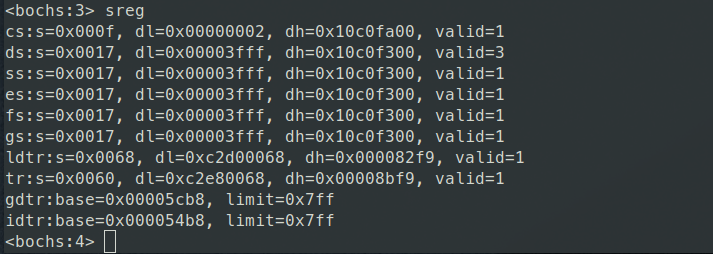
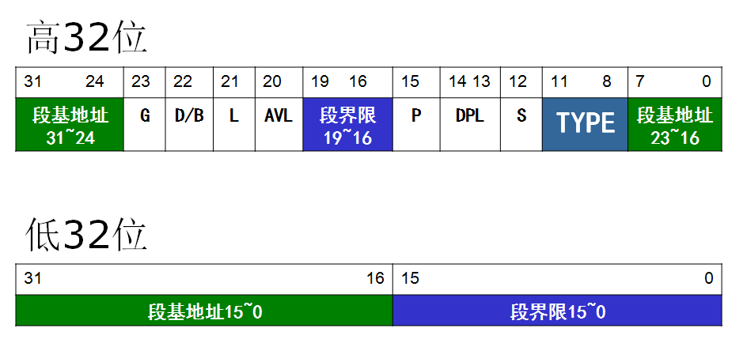

# 跟踪Linux 0.11地址翻译过程

> 用Bochs调试工具跟踪Linux 0.11的地址翻译（地址映射）过程，了解IA-32和Linux 0.11的内存管理机制。
>
> 以汇编级调试的方式启动bochs，引导Linux 0.11，在0.11下编译和运行test.c。它是一个无限循环的程序，永远不会主动退出。然后在调试器中通过查看各项系统参数，从逻辑地址、LDT表、GDT表、线性地址到页表，计算出变量i的物理地址。最后通过直接修改物理内存的方式让test.c退出运行。

首先看看`test.c`的代码：

```c
#include <stdio.h>
int i = 0x12345678;
int main(void)
{
    printf("The logical/virtual address of i is 0x%08x", &i);
    fflush(stdout);
    while (i)
    	;
    return 0;
}
```

在Linux 0.11下跑跑看：


打印出了`i`这个变量的逻辑地址，然后就陷入死循环了。接下来我们要做的就是通过Bochs调试器修改`i`的值，让循环能够退出，也就是将`i`修改为0。

## 地址翻译过程

由于Bochs中我们看到的都是物理地址，我们需要通过`i`的逻辑地址计算出物理地址。我们先来总结一下通过逻辑地址找到真实物理地址的过程：

由于分段机制的存在，我们看到的这个逻辑地址(`0x00003004`)只是段内偏移而已，要找到真实的虚拟地址，我们还需要根据段寄存器找到段基址。

**具体的操作过程如下：**

1. `ds`、`fs`等段寄存器中保存的是段基址在LDT(局部描述符表)中的偏移，也就是说LDT[ds]就是真正的段基址，那么问题就是如何找到LDT的基址？
2. `ldtr`寄存器保存的是当前进程的LDT基址在GDT(全局描述符表)中的偏移，也就是说GDT[ldtr]中就是LDT的基址，那么如何找到GDT的基址呢？`gdtr`寄存器中保存的就是GDT的基址。

综上说述，用一种比较好理解的方式来说就是 真正的虚拟地址=gdtr\[ldtr\]\[ds\] + 段内偏移。接下来就实际操作一下来找到`i`的真正虚拟地址。

## 计算虚拟地址

首先按照实验指导书上写的一通操作将Bochs停在`while`循环里面：


看到，“刚好”停在判断语句上。另外我们还注意到用到的段基址寄存器是`ds`。接下来我们用`sreg`命令查看一下各个寄存器的值：



观察一下我们所关心的几个寄存器的值：`ds`寄存器的值是`0x0017`，`ldtr`的值是`0x0068`，`gdtr`的值是`0x00005cb8`。也就是说GDT表的基址是`0x00005cb8`，而LDT表的基址放在GDT表中的偏移为`0x0068=0000000001101000`(二进制)。由于段选择子（我们提到的段寄存器包括`ds`、`ldtr`都是段选择子）有自己的特定格式，这不是真正的偏移量，那么真正的偏移是多少呢？接下来就要提到段选择子的格式了：


只有前面的13位才是真正的索引号，也就是偏移量。RPL是请求特权级，当访问一个段时，处理器要检查RPL和CPL（放在cs的位0和位1中，用来表示当前代码的特权级），即使程序有足够的特权级（CPL）来访问一个段，但如果RPL（如放在ds中，表示请求数据段）的特权级不足，则仍然不能访问，即如果RPL的数值大于CPL（数值越大，权限越小），则用RPL的值覆盖CPL的值。而段选择子中的TI是表指示标记，如果TI=0，则表示段描述符（段的详细信息）在GDT（全局描述符表）中，即去GDT中去查；而TI=1，则去LDT（局部描述符表）中去查。**那么真正的偏移量就应该是1101(二进制)=13(十进制)**。也就是说LDT的基址是GDT表中的第14项（下标从0开始）。

我们已经知道了GDT表的基址是`0x00005cb8`，LDT表的基址在GDT表中，偏移量为13。接下来查看一下下标为13处的值：使用`xp /2w 0x00005cb8+13*8`查看以8字节单位，下标为13处的值：


可以看到，确实和`ldtr`所在行中`dl`和`dh`的值相同。这就是LDT的物理地址，但是我们还需要根据特定的格式将这两个数字组合起来。接下来我们看看段描述符的格式：



这里，低32位就是`dl=0xc2d00068`，高32位就是`dh=0x000082f9`。根据描述符的格式，将段基址组合起来得到`0x00f9c2d0`。这就是LDT的真正物理地址了。

有了LDT的基址，又有了`ds=0x0017`这个偏移，接下来就能得到`i`的真正虚拟地址了。`ds`是个段选择子，根据段选择子的格式，我们可以算出`ds`对应的偏移为`0x0017=0000000000010111`，其中RPL=11，索引为10(二进制)=2(十进制)，表示查找的是LDT中第三个段描述符（从0开始编号）。接下来查看一下LDT中的第三项：


结果是`0x00003fff`和`0x10c0f300`。同样，我们按照上面的段描述符的格式将其组合起来得到`0x10000000`，这就是`i`的段基址了。**将它和段偏移`0x3004`组合起来得到`0x10003004`，这就是`i`的真正虚拟地址了。**用`calc ds:0x3004`可以验证这个结果：


## 计算物理地址

有了虚拟地址，接下来就是查询页表得到真正的物理地址了。在Linux 0.11中采用的是一个二级页表的结构。将线性地址分为页目录号、页表号和页内偏移，图示如下：


它们分别对应了32位线性地址的10位+10位+12位。所以，虚拟地址`0x10003004`对应的页目录号是64，页表号为3，页内偏移是4。

在IA-32下，页目录表的基址有`CR3`寄存器给出，`creg`命令能够查看：


`CR3=0x00000000`，说明页目录表的基址为0。页目录表中以4字节为单位，查看页目录表中下标为64的位置处的值：


看到值为`0x00faa027`。页表的基址就隐藏在这4字节的数字中。这32位中前20位为物理地址，后面是一些属性信息。因此，`0x00faa027`所代表的物理地址就是`0x00faa`，也即页表的基地址为`0x00faa000`。接下来从这个位置查找页表中下标为3的页表项：


说明真实的页框的基址就是`0x00fa7`，后面的是一些属性信息。我们把页框的基址和业内偏移`0x004`组合到一起，**得到`0x00fa7004`，这就是`i`的物理地址了。**

通过指导书上的命令来验证：


完全正确！

接下来通过直接修改内存来改变`i`的值，使其值为0来退出循环。命令是`setpmem 0x00fa4004 4 0`，表示从0x00fa7004地址开始的4个字节都设为0。然后再用“c”命令继续Bochs的运行，可以看到test退出了，说明i的修改成功了，此项实验结束。

# 基于共享内存的生产者消费者程序

主要是用`shmget()`和`shmat()`这几个函数，使用方法可以查阅`APUE`或者百度。

生产者进程如下：

```c
#include <stdio.h>
#include <semaphore.h>
#include <fcntl.h>
#include <sys/shm.h>
#include <unistd.h>
#include <stdlib.h>

#define BUFSIZE 10
#define MAX_NUM 500

// producer
int main() 
{
    sem_t *empty;
    sem_t *full;
    sem_t *mutex;
    int shmid;
    int *p;
    int i;

    sem_unlink("empty");
    sem_unlink("full");
    sem_unlink("mutex");

    empty = sem_open("empty", O_CREAT | O_EXCL, S_IRWXU, BUFSIZE);
    if (empty == SEM_FAILED)
    {
        fprintf(stderr, "Error when create semaphore empty\n");
        exit(1);
    }

    full = sem_open("full", O_CREAT | O_EXCL, S_IRWXU, 0);
    if (full == SEM_FAILED)
    {
        fprintf(stderr, "Error when create semaphore full\n");
        exit(1);
    }
    mutex = sem_open("mutex", O_CREAT | O_EXCL, S_IRWXU, 1);
    if (mutex == SEM_FAILED)
    {
        fprintf(stderr, "Error when create semaphore mutex\n");
        exit(1);
    }
    printf("Create semphore OK!\n");

    if((shmid = shmget(1024, MAX_NUM * sizeof(int), IPC_CREAT | 0777)) < 0)
    {
        fprintf(stderr, "shmget error\n");
        exit(1);
    }

    if((p = (int *)shmat(shmid, NULL, SHM_EXEC)) == (void *)-1)
    {
        fprintf(stderr, "shmat error\n");
        exit(1);
    }

    for (i = 0; i < MAX_NUM; ++i)
    {
        sem_wait(empty);
        sem_wait(mutex);
        *(p + i % BUFSIZE) = i;
        printf("add %d to buffer\n", i);
        sem_post(mutex);
        sem_post(full);
    }

    sem_unlink("empty");
    sem_unlink("full");
    sem_unlink("mutex");

    return 0;
}

```

消费者进程如下：

```c
#include <stdio.h>
#include <semaphore.h>
#include <stdlib.h>
#include <unistd.h>
#include <sys/shm.h>

#define BUFSIZE 10

#define MAX_NUM 500

sem_t* Sem_open(const char *name, unsigned int value)
{
    sem_t *sem = sem_open(name, value);
    if (sem == SEM_FAILED)
    {
        fprintf(stderr, "Error when create semaphore %s\n", name);
        exit(1);
    }
    return sem;
}

int main()
{
    int i;
    int shmid;
    sem_t *empty;
    sem_t *full;
    sem_t *mutex;
    int *p;
    int data;

    empty = Sem_open("empty", 0);  // 使用现有信号量只需指定名字和flag参数的0值
    full = Sem_open("full", 0);
    mutex = Sem_open("mutex", 0);

    printf("Semaphore Open Sucess!\n");
    fflush(stdout);

    shmid = shmget(1024, (BUFSIZE) * sizeof(int), IPC_CREAT | 0777);

    if (shmid == -1)
    {
        fprintf(stderr, "shmget Error!\n");
        exit(1);
    }

    p = (int *)shmat(shmid, NULL, SHM_EXEC);
    for (i = 0; i < MAX_NUM; ++i)
    {
        sem_wait(full);
        sem_wait(mutex);
        data = *(p + i % BUFSIZE);
        printf("%d: %d\n", getpid(), data);
        fflush(stdout);
        sem_post(mutex);
        sem_post(empty);
    }
    return 0;
}

```

**特别提醒：没有父子关系的进程之间进行共享内存，shmget()的第一个参数key不要用IPC_PRIVATE，否则无法共享。用什么数字可视心情而定，只要确保两个进程用的是同一个值即可。**

# 在Linux0.11下实现共享内存

在整个实现过程中存在着两个问题需要解决。

首先，要获得物理地址非常容易，直接调用`get_free_page()`即可。但是如何在一个进程中获取一个空闲的虚拟地址，然后在页表中将虚拟地址和物理地址联系起来呢？实验指导书中提到，使用`put_page()`可以将建立虚拟地址和物理地址的映射，那么就剩下如何获得一个虚拟地址了。仔细查看注释中的图13-6，进程的PCB中保存着进程所占用的所有内存空间的信息，比如代码段起始位置，代码段结束位置，栈开始位置等等。为了获得一个虚拟地址，我们可以想想当调用`malloc()`动态分配内存空间时是如何获取虚拟地址的。我们会发现，`malloc()`获得的虚拟地址是通过递增`brk`来分配一个虚拟地址的。也就是说，`brk`维持了现在地址空间底端已经使用的虚拟地址，我们也只需要递增`brk`即可获得一块空闲的虚拟地址。另外需要注意的是，图中显示的那些地址比如`start_cdoe`、`end_code`等等都是段内偏移，因此需要先通过`get_base()`获取段基址，加上段基址后才是真正的虚拟地址。

第二个问题我们先看看实现共享内存的代码：

`shm.h`如下：

```c
#ifndef _SHM_H_
#define _SHM_H_

#define SHM_SIZE 20

typedef struct
{
    unsigned int key;
    unsigned int size;
    unsigned long page;  // address
}shm_t;

#endif
```

`shm.c`如下：

```c
#include <shm.h>
#include <unistd.h>
#include <errno.h>
#include <linux/kernel.h>
#include <linux/sched.h>
#include <linux/mm.h>

static shm_t shm_list[SHM_SIZE] = {0};

int sys_shmget(unsigned int key, size_t size)
{
    int i;
    void *page;
    if (size > PAGE_SIZE)
        return -EINVAL;
    page = get_free_page();  // get an empty physic page.
    // printk("get free page in %p\n", page);
    if (!page)
        return -ENOMEM;
    for (i = 0; i < SHM_SIZE; ++i)
        if (shm_list[i].key == key)
            return i;
    // printk("create new share memory space.\n");
    for (i = 0; i < SHM_SIZE; ++i)
    {
        if (shm_list[i].key == 0)  // find an empty slot.
        {
            shm_list[i].key = key;
            shm_list[i].page = page;
            shm_list[i].size = size;
            return i;
        }
    }
    // printk("no empty slot\n");
    return -1;
}

void* sys_shmat(int shmid)
{
    int i;
    void *addr;
    if (0 < shmid || shmid > SHM_SIZE)
        return -EINVAL;
    addr = current->brk + get_base(current->ldt[1]);  // we can use this virtual address
    current->brk += PAGE_SIZE;
    // printk("get an empty virtual address in %p\n", addr);
    if (shm_list[shmid].key != 0)
    {
        put_page(shm_list[shmid].page, addr);
        incr_mem_map(shm_list[shmid].page);   // 重点
        return current->brk - PAGE_SIZE;
    }
    // printk("this share memory is not exits.\n");

    return -EINVAL;
}
```

实现很简单，但是里面还存在一个问题。我们现在的生产消费者程序有两个进程，一个`producer`，一个`consumer`。他们之间共享一块物理内存。当`producer`退出时，操作系统会自动调用`free_page()`来回收这个进程使用的所有内存页，那么也会回收这块共享内存。所谓回收也就是在全局的`mem_map`表中将该物理内存对应的位置的值减一，如果为0了就真正的回收内存，标记为可用。当我们调用`get_free_page()`时只是在`mem_map`中将对应物理内存设置为1，那么`producer`退出时会减小至0，该内存已经被标记为可用了。然后，`consumer`退出，操作系统同样会尝试取释放这块共享内存，但是这块内存已经被释放了，因此会出现`trying to free free page`，接着就会宕机。因此，当我们调用`shmat`时我们需要在`mem_map`中将对应项加一，这样可以避免宕机。但是可能会出现内存泄漏？

因此，我们需要在`memory.c`中增加一个对`mem_map`进行加一操作的函数，如下：

```c
void incr_mem_map(unsigned long addr)
{
        
        mem_map[MAP_NR(addr)]++;
}
```

具体为什么这么实现可以看看《注释》。

接下来就是修改后的`consumer.c`和`producer.c`了，实现如下：

`producer.c`

```c
#define __LIBRARY__

#include <stdio.h>
#include <sem.h>
#include <fcntl.h>
#include <shm.h>
#include <unistd.h>
#include <stdlib.h>

/* for semphare */
_syscall2(sem_t*, sem_open, const char*, name, unsigned int, value);
_syscall1(int, sem_wait, sem_t*, sem);
_syscall1(int, sem_post, sem_t*, sem);
_syscall1(int, sem_unlink, const char*, name);

_syscall1(void*, shmat, int, shmid);
_syscall2(int, shmget, unsigned int, key, size_t, size);

#define BUFSIZE 10
#define MAX_NUM 500

/* producer */
int main() 
{
    sem_t *empty;
    sem_t *full;
    sem_t *mutex;
    int shmid;
    int *p;
    int i;

    sem_unlink("empty");
    sem_unlink("full");
    sem_unlink("mutex");

    empty = sem_open("empty", BUFSIZE);
    full = sem_open("full", 0);
    mutex = sem_open("mutex", 1);

    shmget(1024, MAX_NUM * sizeof(int));
    p = (int *)shmat(shmid);
    
    for (i = 0; i < MAX_NUM; ++i)
    {
        sem_wait(empty);
        sem_wait(mutex);
        *(p + i % BUFSIZE) = i;
        printf("add %d to buffer\n", i);
        fflush(stdout);
        sem_post(mutex);
        sem_post(full);
    }

    /* sem_unlink("empty");
    sem_unlink("full");
    sem_unlink("mutex"); */
    printf("Producer exit\n");
    fflush(stdout);

    return 0;
}
```

`consumer.c`

```c
#define __LIBRARY__

#include <stdio.h>
#include <sem.h>
#include <shm.h>
#include <stdlib.h>
#include <unistd.h>

_syscall2(sem_t*, sem_open, const char*, name, unsigned int, value);
_syscall1(int, sem_wait, sem_t*, sem);
_syscall1(int, sem_post, sem_t*, sem);
_syscall1(int, sem_unlink, const char*, name);

_syscall1(void*, shmat, int, shmid);
_syscall2(int, shmget, unsigned int, key, size_t, size);


#define BUFSIZE 10

#define MAX_NUM 500

sem_t* Sem_open(const char *name, unsigned int value)
{
    sem_t *sem = sem_open(name, value);
    if (sem == NULL)
    {
        fprintf(stderr, "Error when create semaphore %s\n", name);
        exit(1);
    }
    return sem;
}

int main()
{
    int i;
    int shmid;
    sem_t *empty;
    sem_t *full;
    sem_t *mutex;
    int *p;
    int data;

    empty = Sem_open("empty", BUFSIZE);
    full = Sem_open("full", 0);
    mutex = Sem_open("mutex", 1);

    shmid = shmget(1024, (BUFSIZE) * sizeof(int));

    p = (int *)shmat(shmid);

    for (i = 0; i < MAX_NUM; ++i)
    {
        sem_wait(full);
        sem_wait(mutex);
        data = *(p + i % BUFSIZE);
        printf("%d: %d\n", getpid(), data);
        fflush(stdout);
        sem_post(mutex);
        sem_post(empty);
    }
    return 0;
}

```

也没有太大的改动。

另外还有一个注意点，我的这两个程序中没有对信号量进行释放，因为如果在`producer`中释放了在`consumer`中就没法访问了。当然，你可以在`consumer`中释放，但是我觉得这样并不优雅。。所以就没这样做。如果想做到释放，那么可以在信号量的实现中增加计数器，如果计数值为0了才真正释放该信号量，这样就可以比较优雅的在生产消费者程序中释放信号量了。在此我没有实现。

